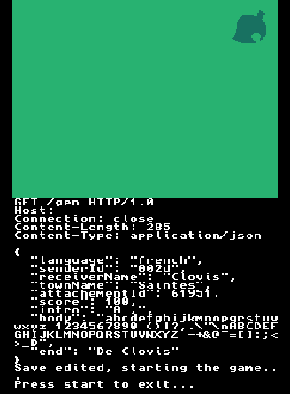

# Animal Crossing Wild World - Letter Response System

This project aims to enhance the gameplay experience of **Animal Crossing: Wild World** by enabling villagers to genuinely respond to letters sent by players. The system consists of two main components: a **client** (a DS homebrew application) and a **server** (responsible for generating responses).



## Overview

The system works as follows:
1. The **client** reads the letters sent by the player from the game's save memory.
2. The **server** generates personalized responses based on the villager's personality and the content of the player's letter.
3. The **client** injects the generated response into the game's memory, replacing the player's letter to prevent duplicate responses.

## Installation

As a user you only need to install the client on your console. You also need to configure your client with the `ac.txt` file described below.  
To use the server, you have to know a running Antoine server by it's address.

### Client
A DS homebrew application that:
- Reads and writes memory to interact with the game's save data.
- Communicates with the server to fetch generated responses.
- Requires configuration via a file named `ac.txt` located alongside the homebrew on the DS's SD card. The file must be formatted as follows:
  ```
  <server>        # Remote server address
  <port>          # Remote server port
  <lang>          # Language for villager responses (Supported: english, french)
  <launcher>      # true/false - Launch AC:WW with nds-bootstrap after editing (only available on NDS)
  <bootstrapNDS>  # Path to nds-bootstrap executable (only available on NDS), set to empty line on 3ds
  <bootstrapINI>  # Path to nds-bootstrap configuration file (only available on NDS), set to empty line on 3ds
  <rom>           # On nds: Path to the AC:WW ROM file on nds / On 3ds: Title id of AC:WW
  <save>          # Path to the AC:WW save file
  <empty line >   # The file must end with an empty line
  ```
- Requires an active internet connection to communicate with the server. This connection must be configured beforehand. If running on a 3DS, ensure that a DS connection is set up in the system settings for the homebrew to function properly.

#### Installation on 3DS
1. Download the `3ds.zip` file from the latest release.
2. Extract the archive and place the `Antoine` folder into the `3ds` directory on your console's SD card.
3. Place the `ac.txt` configuration file inside the `Antoine` folder. Ensure it is formatted as described above.

#### Installation on DS
1. Download the `nds.zip` file from the latest release.
2. Extract the archive and locate the `.nds` file inside.
3. Place the `.nds` file alongside your other `.nds` files on your flashcard or SD card.
4. Place the `ac.txt` configuration file inside the same folder. Ensure it is formatted as described above.

### Server
A backend system that:
- Processes requests from the client.
- Generates villager responses using a language model (currently Mistral, with plans for a local CPU-based model).
- Requires the following environment variables to function correctly:
  - `GIN_MODE`: Specifies the mode in which the server operates (release).
  - `PORT`: Defines the port on which the server listens for incoming connections.
  - `API_KEY`: Contains a valid Mistral API key for accessing the `mistral-small-latest` model.
  
#### Prompt Configuration
The server requires a file named `prompt.txt` located in its directory. This file contains the prompt template sent to the language model. The template must use the following placeholders in this specific order:

- `%s`: Town name
- `%s`: Villager description
- `%s`: Receiver's name
- `%s`: Attachment name ("No package" will be inserted if there is no attachment)
- `%s`: Letter content from the player
- `%s`: Tone to use
- `%s`: Language

The placeholders will be dynamically replaced with the appropriate values during runtime. Ensure the prompt is crafted to guide the language model in generating accurate and immersive responses.

## References

- [ACWW-Web-SaveEditor](https://github.com/Universal-Team/ACWW-Web-SaveEditor/blob/main/assets/js/core/letter.js)
- [Animal Crossing Letters Project](https://jamchamb.net/projects/animal-crossing-letters)
- [GameFAQs Discussion on Letter Buffers](https://gamefaqs.gamespot.com/boards/920786-animal-crossing-wild-world/41195712)

